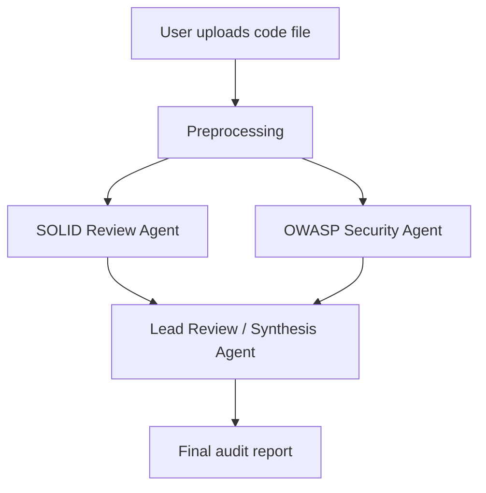

# Agentic AI Code Auditor & Security Engine

A multi-agent code review tool built with Python, Streamlit and the Google Gemini API. Upload a source file and separate AI agents review it for architectural (SOLID) problems and common security vulnerabilities (OWASP Top 10), then a lead-review step combines their findings into one report.

**Live Demo:** [https://agentic-ai-automation-engine-tkffpe9jdaahya6o68f6mm.streamlit.app/](https://agentic-ai-automation-engine-tkffpe9jdaahya6o68f6mm.streamlit.app/)
*(You need your own free Gemini API key to run an audit.)*

---

## Overview

Manual code review is slow, and security or design problems are easy to miss. This project explores whether several specialised LLM agents, each with one focused task, can give a more organised review than a single general prompt.

---

## Features

- **Multi-agent review:** Separate agents handle SOLID design review and OWASP-style security scanning, and a lead review step combines the results.
- **Multiple languages:** Accepts `.py`, `.js`, `.cpp`, `.java` and `.sql` files.
- **Sample scripts:** Pre-loaded test scripts in the sidebar for quick trials.
- **Streamlit interface:** Upload a file, click "Run Multi-Agent Audit", and read the combined report.
- **Docker support:** A `Dockerfile` is included for containerised runs.
- **Automated tests:** Basic tests in the `tests/` folder, run through a GitHub Actions workflow.

---

## System Architecture



| Agent | Responsibility |
|-------|----------------|
| SOLID Review Agent | Looks for architectural and design-principle problems |
| OWASP Security Agent | Looks for common security vulnerabilities |
| Lead Review Agent | Combines the findings into one report with recommendations |

---

## Tech Stack

| Area | Tools |
|------|-------|
| Language | Python |
| Interface | Streamlit |
| LLM | Google Gemini API |
| Testing | pytest |
| CI | GitHub Actions |
| Containerisation | Docker |

---

## Project Structure

```
Agentic-AI-Automation-Engine/
├── .github/workflows/   # CI workflow (tests.yml)
├── .streamlit/          # Streamlit configuration
├── data/                # Sample code files
├── docs/                # Documentation
├── img/                 # Screenshots and images
├── mermaid/             # Architecture diagrams
├── src/                 # Agent and analysis code
├── tests/               # test_agents.py, test_analysis.py
├── Dockerfile
├── LICENSE
├── README.md
└── requirements.txt
```

---

## Setup and Run Locally

**1. Clone the repository**
```bash
git clone https://github.com/yadavneha2004-star/Agentic-AI-Automation-Engine.git
cd Agentic-AI-Automation-Engine
```

**2. Create a virtual environment (recommended)**
```bash
python -m venv venv
# Windows
venv\Scripts\activate
# macOS / Linux
source venv/bin/activate
```

**3. Install dependencies**
```bash
pip install -r requirements.txt
```

**4. Run the app**
```bash
streamlit run app.py
```

**5. Add your API key**
Open the app (usually `http://localhost:8501`), paste your Gemini API key in the sidebar under "Configuration", upload a code file or choose a sample script, and click **Run Multi-Agent Audit**.

You can get a free Gemini API key from Google AI Studio. Never commit your API key to GitHub.

---

## Run with Docker

```bash
docker build -t code-auditor .
docker run -p 8501:8501 code-auditor
```

Then open `http://localhost:8501`.

---

## Run Tests

```bash
pip install pytest
pytest tests/ -v
```

---

## Limitations

- **LLM output can be wrong or inconsistent.** The same file may produce slightly different findings on different runs, and the tool can report false positives or miss real issues.
- **It is not a replacement for established tools** such as Bandit, Semgrep or SonarQube, or for human review.
- **Very large files** may exceed the model's context window, so they should be split before analysis.
- **Language coverage is uneven.** It has mostly been tried on small to medium files.
- **No formal accuracy has been measured yet.** See the Evaluation section.

---

## Evaluation

*A small evaluation on files with known vulnerabilities is planned, and results will be added here.*

---

## Roadmap

- [ ] Evaluate detection quality on labelled vulnerable and clean code
- [ ] Compare results with Bandit / Semgrep
- [ ] Add more languages (Go, Rust, TypeScript)
- [ ] Support custom review rules
- [ ] Add suggested auto-fix patches

---

## License

This project is licensed under the MIT License. See the [LICENSE](LICENSE) file for details.

---

## Author

**Neha Salla**
- GitHub: [@yadavneha2004-star](https://github.com/yadavneha2004-star)
- Email: yadav.neha2004@gmail.com
